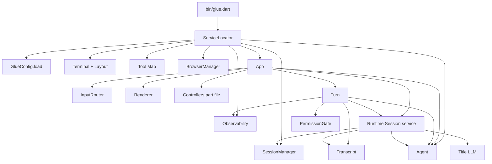
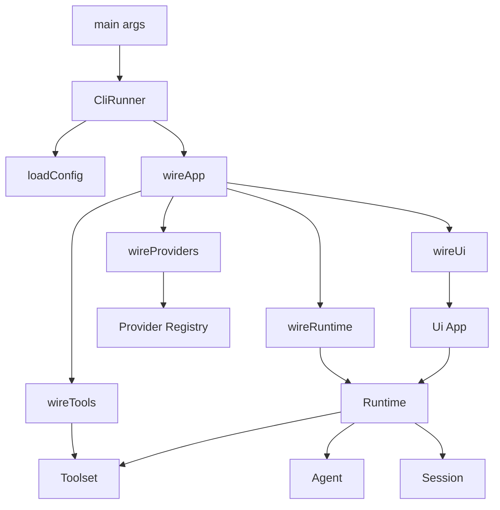
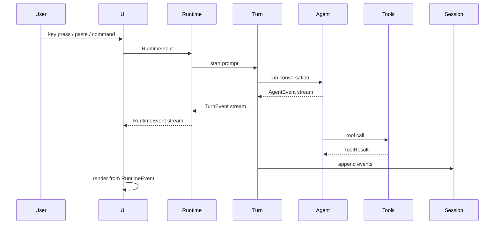
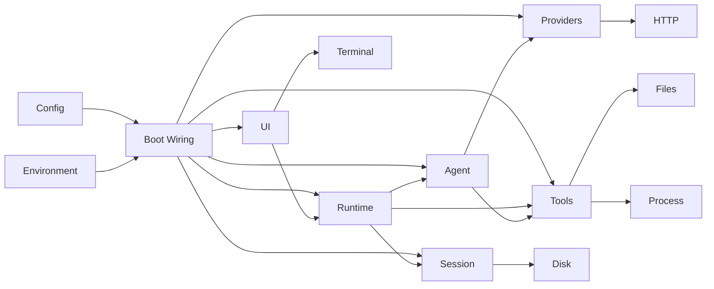

# Target Architecture

This document describes the desired end state for the CLI refactor. It is not a request to rewrite everything at once. The phase files in this directory are the migration path that preserves behavior while moving toward this shape.

## Goals

- Remove the service locator and replace it with explicit wiring.
- Rename internal types toward established, concise names, for example `GlueConfig` becomes `Config`.
- Keep abstractions where there are multiple real implementations or a stable protocol boundary, such as `Tool`, provider clients, sinks, and command execution.
- Avoid inheritance and interfaces for single-consumer, single-implementation code.
- Replace broad controller objects with explicit dependencies, typed events, and smaller collaborators.
- Use Dart streams at useful asynchronous boundaries: user input, agent output, turn events, runtime events, subprocess output, and UI repaint triggers.
- Use direct method calls inside a cohesive module where streams would only add indirection.
- Remove `part` files and use normal imports.
- Keep related classes in one file when they form one concept and remain easy to scan.
- Organize folders by responsibility and dependency direction, not by historical growth.

## Non-Goals

- Do not rewrite the agent loop just to make it look more abstract.
- Do not add factories, interfaces, or base classes unless they remove real coupling or support multiple implementations.
- Do not change user-visible behavior unless a phase explicitly calls out a compatibility fix.
- Do not move every class into its own file. Cohesion matters more than file count.

## Naming Rules

Prefer single-word names when they are clear:

- `Config`, not `GlueConfig`.
- `Runtime`, not `AppRuntimeCoordinator`.
- `Turn`, not `AgentTurnExecutionManager`.
- `Session`, `Store`, `Log`, `Replay`, `Fork`, `Catalog`, `Provider`, `Client`, `Tool`, `Shell`, `Browser`.

Use compound names when they are established or materially clearer:

- `CommandExecutor`
- `ScreenBuffer`
- `TitleGenerator`
- `PermissionGate`
- `TextAreaEditor`
- `ModelCatalog`

Avoid vague suffixes unless they are truly accurate:

- Avoid `Manager` for ordinary coordination.
- Avoid `Service` for plain domain/application objects.
- Avoid `Helper` and `Utils`; name files after what they do.
- Avoid `Adapter` unless the class is actually adapting one interface to another.

## Dependency Rule

Dependencies should point inward toward stable logic:

```text
bin -> boot -> runtime -> agent/tools/session/providers
                 |
                 v
                ui

infrastructure is injected inward:
terminal, files, process, http, browser, credentials, observability
```

The important rule is not the exact folder name. The important rule is that UI, filesystems, HTTP, process execution, and terminal control are edges. Core application logic should receive those capabilities explicitly.

## Current Coupling



The current design works, but it has several high-friction areas:

- `ServiceLocator` is a composition root, provider factory, tool registry, browser factory, observability decorator, and app builder.
- `GlueConfig.load` parses and validates too many unrelated sections and constructs provider-related runtime state.
- `App`, `Turn`, and the runtime session service share UI, persistence, agent, and observability responsibilities.
- Tools have a good contract, but concrete tools are concentrated in one large module.
- Some naming still reflects older architecture, especially provider adapter/client vocabulary.

## Target Structure

The target folder structure should look approximately like this:

```text
cli/
  bin/
    glue.dart

  lib/src/
    boot/
      wire.dart
      providers.dart
      tools.dart
      ui.dart

    cli/
      runner.dart
      config.dart
      doctor.dart
      completion.dart

    config/
      config.dart
      load.dart
      source.dart
      model.dart
      shell.dart
      web.dart
      browser.dart
      observability.dart
      errors.dart

    runtime/
      runtime.dart
      events.dart
      input.dart
      turn.dart
      approval.dart
      print.dart

    agent/
      agent.dart
      conversation.dart
      events.dart
      prompts.dart
      repair.dart

    tools/
      tool.dart
      context.dart
      files.dart
      shell.dart
      search.dart
      web.dart
      skills.dart
      subagents.dart

    providers/
      provider.dart
      openai.dart
      anthropic.dart
      ollama.dart
      copilot.dart
      auth.dart
      catalog.dart

    session/
      session.dart
      store.dart
      log.dart
      replay.dart
      fork.dart
      title.dart

    ui/
      app.dart
      renderer.dart
      transcript.dart
      terminal/
      panels/
      components/

    shell/
    skills/
    web/
    share/
    observability/
    core/
```

This is an output shape, not a first patch. Some names may stay where moving them would create churn without architectural value. The phase files define which moves are worth doing.

## Target Wiring

There should be no runtime service locator and no object that exposes a bag of unrelated dependencies. Wiring should be a set of small top-level functions that construct concrete objects and pass dependencies explicitly.



The wiring layer may have concrete dependency containers when that reduces constructor noise, for example `RuntimeDeps` or `ToolDeps`. Those containers should be typed construction arguments, not a lookup mechanism.

Good:

```dart
final runtime = Runtime(
  agent: agent,
  session: session,
  tools: tools,
  approvals: approvals,
  clock: env.clock,
);
```

Avoid:

```dart
final runtime = Runtime(services);
runtime.services.get<Agent>();
```

## Target Event Flow

Use streams when one component produces asynchronous events consumed by another component. Avoid using streams as a substitute for simple function calls.



Expected streams:

- `Agent.run(...) -> Stream<AgentEvent>`
- `Turn.run(...) -> Stream<TurnEvent>`
- `Runtime.events -> Stream<RuntimeEvent>`
- terminal/input streams
- subprocess output streams
- observability sinks where async export is required

Expected direct calls:

- config parsing helpers
- path normalization helpers
- transcript formatting
- command registration
- constructing providers/tools
- validating model refs

## Target Layer Responsibilities

### `bin`

Only owns the executable entrypoint:

- process arguments
- exit codes
- top-level exception printing
- calling `CliRunner`

It should not construct providers, tools, terminal UI, or completion installers directly.

### `cli`

Owns command-line command registration and subcommands:

- `glue`
- `glue config`
- `glue doctor`
- `glue completion`

This layer may call config loading and boot wiring, but it should not know how individual tools or providers are built.

### `boot`

Owns concrete construction:

- build config-dependent providers
- build tools
- build UI objects
- build runtime objects
- decorate HTTP clients for observability

It should be the only place where broad construction knowledge is acceptable. Even here, split by subsystem rather than keeping one 300-line function.

### `config`

Owns loading and validating configuration:

- read files
- read environment values
- merge defaults
- validate model/provider references
- return immutable `Config`

It should not construct runtime clients. It may return provider configuration records, but not live provider instances.

### `runtime`

Owns application state and workflow:

- accept user inputs
- start and cancel turns
- coordinate approvals
- route slash commands
- emit runtime events
- keep print mode and interactive mode behavior consistent

It should not render terminal UI directly and should not read or write session files directly.

### `agent`

Owns the LLM/tool protocol:

- conversation state
- streaming model output
- tool-call completion
- cancellation repair
- agent events

It should know the `Tool` contract and `Llm` client contract. It should not know about terminal panels, sessions, or config files.

### `tools`

Owns the tool protocol and concrete built-in tools:

- abstract `Tool`
- `ToolContext`
- filesystem tools
- shell tools
- search tools
- web tools
- skill and subagent tools

`Tool` is a meaningful abstraction because there are many implementations and the agent depends on a stable protocol.

### `session`

Owns persistence and replay:

- session ids
- metadata
- append-only event log
- replay to conversation records
- fork logic
- title generation coordination

It should not mutate UI transcript directly. It should return data or events that runtime/UI can apply.

### `ui`

Owns presentation:

- terminal lifecycle
- layout
- rendering
- transcript display
- panels, docks, modals, overlays
- input widgets

It should subscribe to runtime events and call runtime commands. It should not own agent or session persistence.

## Coupling Boundaries



Rules:

- `agent` does not import `ui`.
- `agent` does not import `session`.
- `session` does not import `ui`.
- `config` does not import provider implementations.
- `runtime` may import contracts and concrete application objects, but not low-level file/process/HTTP details directly.
- `boot` may import broadly because it is the construction boundary.
- tests may use fakes without requiring inherited base classes.

## Error Behavior

The target architecture should preserve the current user experience while making error paths easier to reason about:

- Config errors are typed and include a user-facing message plus optional diagnostic detail.
- Provider errors distinguish auth, unsupported model, transport, rate limit, and malformed response.
- Tool errors return structured `ToolResult` failures instead of throwing across the agent boundary where possible.
- Session replay tolerates malformed legacy records but records diagnostics for `doctor`.
- Terminal teardown is best-effort and never masks the original failure.
- Print mode emits machine-readable failures consistently when JSON output is enabled.

## Testability Targets

Each phase should leave the suite easier to test:

- Config can be tested with in-memory sources and environment maps.
- Wiring can be smoke-tested without launching terminal raw mode.
- Runtime can be tested with fake streams and fake UI sinks.
- Agent can be tested with fake LLM clients and fake tools.
- Tools can be tested with temp directories and injected process/file collaborators where useful.
- Session can be tested with temp stores and deterministic clocks.
- UI can be tested with fake terminal dimensions and rendered buffer snapshots.

## Completion Criteria

The refactor is complete when:

- `ServiceLocator` is deleted.
- `GlueConfig` is replaced by `Config`.
- There are no `part` files.
- The full Dart test suite passes.
- The default interactive flow and print mode continue to work.
- Runtime, session, tools, providers, config, and UI can be reasoned about independently.
- New features can usually be added by touching one subsystem plus wiring/tests, not `App`, config, service locator, and session code together.
