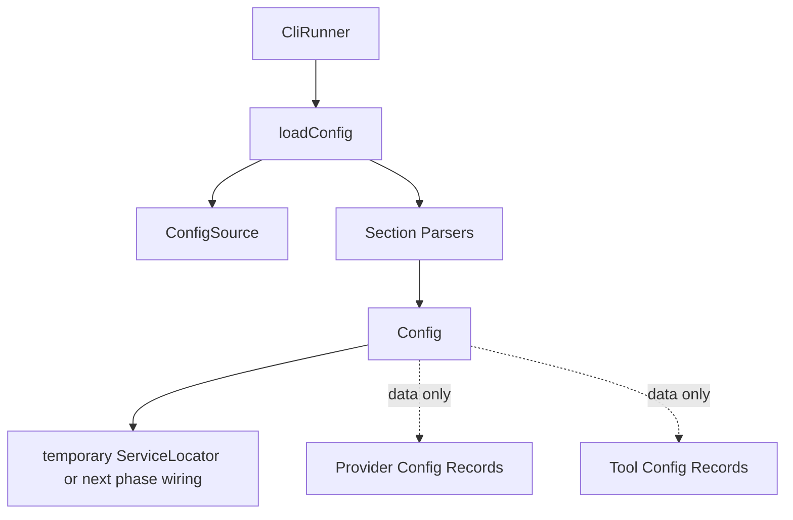

# Phase 1 - Config

## Objective

Replace the monolithic `GlueConfig` loader with an immutable `Config` model and focused config loading modules. This phase establishes the naming and data-flow foundation for removing the service locator later.

## Design Direction

`Config` should be plain data plus small domain helpers. Loading should be a separate function or small loader module. Provider construction, HTTP client decoration, tool construction, and UI construction should not happen in config.

Current broad responsibility:

```text
GlueConfig.load
  reads files
  reads env
  reads credentials
  loads model catalog
  resolves providers
  resolves active/small models
  parses shell/docker/web/browser/pdf/ocr/observability/skills/approval/title
  creates adapter registry data
  prints warnings
```

Target responsibility:

```text
loadConfig
  reads sources
  parses sections
  validates section consistency
  returns immutable Config
```

## Files Expected To Be Touched

Primary:

- `cli/lib/src/config/glue_config.dart`
- `cli/lib/src/config/config_template.dart`
- `cli/lib/src/config/constants.dart`
- `cli/lib/src/config/approval_mode.dart`
- `cli/lib/src/runtime/services/config.dart`
- `cli/lib/src/core/service_locator.dart`
- `cli/lib/src/providers/llm_client_factory.dart`
- `cli/lib/src/providers/provider_adapter.dart`
- `cli/lib/src/web/web_config.dart`
- `cli/lib/src/web/browser/browser_config.dart`
- `cli/lib/src/observability/observability_config.dart`
- config tests under `cli/test/config/`
- provider config tests under `cli/test/providers/`

Secondary import updates are expected in:

- `cli/bin/glue.dart`
- `cli/lib/src/app.dart`
- `cli/lib/src/runtime/controllers/provider_controller.dart`
- `cli/lib/src/runtime/controllers/model_controller.dart`
- `cli/lib/src/runtime/controllers/system_controller.dart`
- `cli/lib/src/runtime/turn.dart`
- any file importing `GlueConfig`

## Target File Structure

```text
cli/lib/src/config/
  config.dart          # immutable Config and top-level section records
  load.dart            # loadConfig entrypoint
  source.dart          # config path/env/file source helpers
  model.dart           # model/profile/provider reference parsing
  shell.dart           # shell/docker config parsing
  web.dart             # fetch/search/browser/pdf/ocr config parsing
  observability.dart   # observability section parsing
  skills.dart          # skill path/config parsing
  errors.dart          # ConfigError and diagnostics
  template.dart        # generated/default template data if kept
```

Possible cleanup:

```text
cli/lib/src/runtime/services/config.dart -> cli/lib/src/runtime/settings.dart
```

The current runtime config service should not block the `Config` class rename. If a name conflict appears, rename the runtime service to `Settings`, because that better describes mutable user config commands.

## Target Public Shape

Preferred:

```dart
final config = await loadConfig(
  args: args,
  env: env,
  overrides: overrides,
);
```

`Config` should be immutable:

```dart
class Config {
  const Config({
    required this.models,
    required this.shell,
    required this.web,
    required this.browser,
    required this.observability,
    required this.skills,
    required this.approvals,
  });

  final ModelConfig models;
  final ShellConfig shell;
  final WebConfig web;
  final BrowserConfig browser;
  final ObservabilityConfig observability;
  final SkillConfig skills;
  final ApprovalConfig approvals;
}
```

Use names that are clear in Dart even if they are compound. `ModelConfig` and `ShellConfig` are acceptable because `Model` and `Shell` alone would be ambiguous as config sections.

## Data-Flow Rules

- Config loading may read files and environment variables.
- Config loading may validate that references are coherent.
- Config loading may return diagnostics or warnings.
- Config loading must not create live clients.
- Config loading must not mutate provider registries after returning.
- Config loading must not write to stderr directly except at the CLI boundary.

Warnings should become structured diagnostics:

```dart
class ConfigResult {
  const ConfigResult(this.config, this.diagnostics);

  final Config config;
  final List<ConfigDiagnostic> diagnostics;
}
```

If this is too much churn for phase 1, keep the return type as `Config` and move diagnostics in a later pass. Do not introduce a result wrapper unless it immediately removes existing direct stderr behavior.

## Migration Steps

1. Introduce `Config` as an alias or replacement for `GlueConfig`.
   - Start with minimal behavior change.
   - Update imports and type names.
   - Keep tests focused on equivalence.

2. Extract section records from `glue_config.dart`.
   - Move shell/docker config parsing into `config/shell.dart`.
   - Move web/browser/OCR/PDF parsing into `config/web.dart` or keep existing `web` records and parse from config.
   - Move observability parsing into `config/observability.dart`.
   - Move model/profile/provider ref parsing into `config/model.dart`.

3. Extract source reading.
   - `source.dart` owns path resolution and raw YAML/env reads.
   - Section parsers should receive maps or typed source values, not read files themselves.

4. Remove runtime construction from config.
   - Leave provider references as data.
   - Provider/client creation will move fully in phase 2.

5. Rename runtime config command service if needed.
   - `runtime/services/config.dart` should become `runtime/settings.dart` or similar.
   - Keep command behavior unchanged.

6. Delete or shrink `glue_config.dart`.
   - Preferred end state: no `GlueConfig` identifier.
   - Temporary acceptable state: `glue_config.dart` exports `config.dart` during the migration, then is deleted in the same phase if low risk.

## End-State Architecture

At the end of this phase:



The service locator may still exist at the end of this phase, but it should receive a cleaner `Config` object and should no longer rely on mutating config internals.

## Tests

Required:

- existing config tests still pass
- env override tests
- config file path tests
- legacy config rejection tests
- model ref/profile resolution tests
- provider credential config tests

Add if missing:

- parser tests for each extracted config section
- test that `Config` is not mutated by provider/client decoration
- test that diagnostics are returned or printed at the CLI boundary only

## Acceptance Criteria

- No `GlueConfig` public type remains.
- Config is immutable after load.
- Section parsing is split by responsibility.
- Provider/client instances are not created by config loading.
- `dart analyze` passes.
- full Dart tests pass.

## Risks

- Renaming `GlueConfig` will touch many imports. Keep the first commit mechanical before extracting behavior.
- Existing runtime config command code may conflict with the name `Config`. Rename that code to `Settings` rather than compromising the core config name.
- Do not introduce a generic config abstraction with one implementation. Concrete section parsers are enough.
