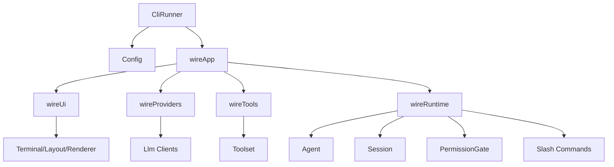

# Phase 2 - Wiring

## Objective

Delete `ServiceLocator` and replace it with explicit boot wiring. Construction should be visible, typed, and split by subsystem.

## Current Problem

`ServiceLocator.create` currently knows about config loading, terminal setup, skills, observability, provider/client creation, search, browser backends, tool creation, agent creation, subagents, and app construction. It is a convenient composition root, but it has become a god module.

The goal is not to remove a file named service locator and hide the same behavior elsewhere. The goal is to make construction explicit and grouped by responsibility.

## Files Expected To Be Touched

Primary:

- `cli/lib/src/core/service_locator.dart`
- `cli/bin/glue.dart`
- `cli/lib/src/app.dart`
- `cli/lib/src/agent/agent.dart`
- `cli/lib/src/agent/subagents.dart`
- `cli/lib/src/agent/tools.dart`
- `cli/lib/src/providers/llm_client_factory.dart`
- `cli/lib/src/tools/subagent_tools.dart`
- `cli/lib/src/tools/web_browser_tool.dart`
- `cli/lib/src/tools/web_fetch_tool.dart`
- `cli/lib/src/tools/web_search_tool.dart`
- `cli/lib/src/web/search/search_router.dart`
- `cli/lib/src/web/browser/browser_manager.dart`
- `cli/lib/src/observability/*`
- wiring-related tests or app startup tests

New:

- `cli/lib/src/boot/wire.dart`
- `cli/lib/src/boot/providers.dart`
- `cli/lib/src/boot/tools.dart`
- `cli/lib/src/boot/ui.dart`
- optionally `cli/lib/src/boot/runtime.dart`

## Target File Structure

```text
cli/lib/src/boot/
  wire.dart       # top-level app/runtime wiring
  providers.dart  # provider and LLM client construction
  tools.dart      # built-in toolset construction
  ui.dart         # terminal/layout/editor/renderer wiring
  runtime.dart    # runtime/session/agent wiring if wire.dart gets too large
```

Avoid creating:

```text
boot/container.dart
boot/service_locator.dart
boot/registry.dart
```

unless the object is a real domain registry, such as a provider registry or toolset.

## Target Public Shape

Preferred CLI flow:

```dart
Future<int> runGlue(List<String> args, Environment env) async {
  final command = parseCommand(args);
  final config = await loadConfig(command.configArgs, env: env);
  final app = await wireApp(config: config, env: env, command: command);
  return app.run();
}
```

Preferred wiring shape:

```dart
Future<App> wireApp({
  required Config config,
  required Environment env,
  required Startup startup,
}) async {
  final ui = wireUi(config: config, env: env);
  final providers = await wireProviders(config: config, env: env);
  final tools = await wireTools(config: config, env: env, providers: providers);
  final runtime = wireRuntime(
    config: config,
    env: env,
    ui: ui,
    providers: providers,
    tools: tools,
    startup: startup,
  );

  return App(ui: ui, runtime: runtime);
}
```

Concrete dependency bundles are acceptable if they are not lookup containers:

```dart
class WiredProviders {
  const WiredProviders({
    required this.llm,
    required this.smallLlm,
    required this.catalog,
  });

  final Llm llm;
  final Llm? smallLlm;
  final ModelCatalog catalog;
}
```

## Data-Flow Rules

- `boot` is allowed to import widely.
- Objects constructed by `boot` should receive exact dependencies.
- Runtime code should not ask a container for dependencies.
- Config decoration, observability wrapping, provider creation, and tool creation happen in boot functions.
- The app should not construct core services lazily by reaching back into boot.

## Migration Steps

1. Create `boot` files while keeping `ServiceLocator` as a temporary caller.
   - Extract provider construction into `wireProviders`.
   - Extract tool construction into `wireTools`.
   - Extract terminal/UI construction into `wireUi`.
   - Extract agent/session/runtime construction into `wireRuntime`.

2. Update `ServiceLocator.create` to delegate to boot functions.
   - This keeps behavior stable while the construction code moves.
   - Tests should still pass after each extraction.

3. Update `bin/glue.dart` to call `wireApp` directly.
   - Remove `ServiceLocator` from the CLI path.

4. Delete `ServiceLocator`.
   - Remove imports.
   - Remove `AppServices` if it is only a locator-shaped bundle.
   - Keep small typed bundles only where they make constructors readable.

5. Move observability HTTP decoration.
   - Config should remain immutable.
   - Provider wiring should receive an HTTP client factory and return decorated clients.

6. Keep lazy construction where it has real value.
   - Browser startup can stay lazy.
   - Search router can stay lazy.
   - Lazy values should be explicit closures, not service lookups.

## End-State Architecture



There is no object in this diagram that runtime code can query for arbitrary services.

## Tests

Required:

- app startup tests
- print mode tests
- provider wiring tests
- tool registration tests
- observability wrapping tests
- browser/search lazy construction tests if existing behavior depends on laziness

Add if missing:

- `wireProviders` test with fake config and fake env
- `wireTools` test that expected built-in tools are present
- `wireApp` smoke test that does not enter raw terminal mode

## Acceptance Criteria

- `cli/lib/src/core/service_locator.dart` is deleted.
- No `ServiceLocator` identifier remains.
- Runtime code receives constructor dependencies explicitly.
- Config is not mutated during wiring.
- Lazy subsystems are represented by typed closures or objects, not a locator.
- `dart analyze` passes.
- full Dart tests pass.

## Risks

- Extracting construction can accidentally change construction order. Preserve the old order first, then simplify.
- Laziness is likely intentional for browser/search. Do not eagerly launch expensive resources.
- Do not turn `wire.dart` into the new 500-line god module. Split by subsystem immediately.
