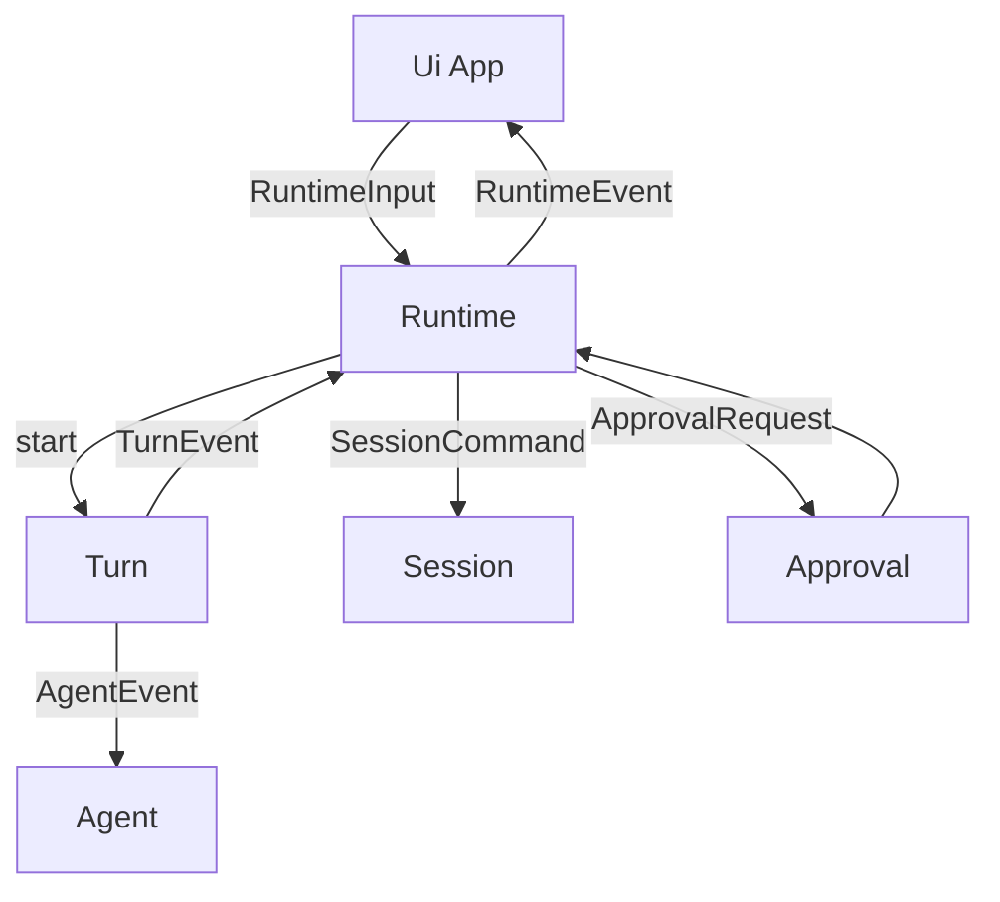

# Phase 3 - Runtime Events And Turn Boundaries

## Objective

Separate runtime orchestration from terminal presentation and split `Turn` into smaller responsibilities. Introduce typed Dart event streams at the boundaries where asynchronous state changes cross subsystems.

## Current Problem

`App` and `Turn` currently coordinate too much:

- user input routing
- transcript mutation
- rendering triggers
- session logging
- permission prompts
- agent streaming
- print mode output
- mode/spinner updates
- observability spans

The code is not chaotic, but these responsibilities change for different reasons. The target is to keep the workflow clear while making UI, session, and agent execution testable independently.

## Files Expected To Be Touched

Primary:

- `cli/lib/src/app.dart`
- `cli/lib/src/app/controllers.dart`
- `cli/lib/src/app/paint.dart`
- `cli/lib/src/runtime/turn.dart`
- `cli/lib/src/runtime/app_events.dart`
- `cli/lib/src/runtime/app_mode.dart`
- `cli/lib/src/runtime/input_router.dart`
- `cli/lib/src/runtime/permission_gate.dart`
- `cli/lib/src/runtime/renderer.dart`
- `cli/lib/src/runtime/transcript.dart`
- `cli/lib/src/runtime/controllers/*.dart`
- `cli/lib/src/runtime/commands/*.dart`
- `cli/lib/src/ui/services/*.dart`
- app/runtime/input tests

New or reshaped:

- `cli/lib/src/runtime/runtime.dart`
- `cli/lib/src/runtime/events.dart`
- `cli/lib/src/runtime/input.dart`
- `cli/lib/src/runtime/turn.dart`
- `cli/lib/src/runtime/approval.dart`
- `cli/lib/src/runtime/print.dart`
- `cli/lib/src/ui/app.dart`

## Target File Structure

```text
cli/lib/src/runtime/
  runtime.dart     # application workflow and state transitions
  events.dart      # RuntimeEvent, RuntimeInput, TurnEvent
  input.dart       # input routing boundary types
  turn.dart        # Turn runner, no terminal rendering
  approval.dart    # approval coordination
  print.dart       # print mode runner/output policy
  commands/
  controllers/

cli/lib/src/ui/
  app.dart         # terminal UI shell
  renderer.dart
  transcript.dart
  services/
  components/
```

No `part` files should remain after this phase if the `app/controllers.dart` split is included here. If removing the part file creates too much churn, move it to phase 7, but the preferred output is normal imports now.

## Target Event Types

Runtime inputs:

```dart
sealed class RuntimeInput {
  const RuntimeInput();
}

final class SubmitPrompt extends RuntimeInput {
  const SubmitPrompt(this.text);
  final String text;
}

final class RunSlashCommand extends RuntimeInput {
  const RunSlashCommand(this.command);
  final String command;
}
```

Runtime events:

```dart
sealed class RuntimeEvent {
  const RuntimeEvent();
}

final class ModeChanged extends RuntimeEvent { ... }
final class TranscriptChanged extends RuntimeEvent { ... }
final class ApprovalRequested extends RuntimeEvent { ... }
final class TurnStarted extends RuntimeEvent { ... }
final class TurnFinished extends RuntimeEvent { ... }
final class RuntimeError extends RuntimeEvent { ... }
```

Turn events:

```dart
sealed class TurnEvent {
  const TurnEvent();
}

final class AssistantChunk extends TurnEvent { ... }
final class ToolStarted extends TurnEvent { ... }
final class ToolFinished extends TurnEvent { ... }
final class ToolApprovalNeeded extends TurnEvent { ... }
final class TurnCompleted extends TurnEvent { ... }
```

Do not create event classes for every private method call. Events are for crossing runtime/UI/session boundaries.

## Target Data Flow



## Migration Steps

1. Define event types first.
   - Start with existing concepts, not speculative categories.
   - Keep names established: input, event, turn, runtime, approval.

2. Extract print mode from `Turn`.
   - Print mode has different output and error behavior.
   - Keep behavior identical.
   - Add tests around stdout/stderr/JSON behavior.

3. Extract approval coordination.
   - `Turn` should emit approval-needed events or call an approval collaborator.
   - UI prompt behavior should live at the presentation boundary.

4. Make `Turn` independent of terminal rendering.
   - It may emit transcript-oriented events.
   - It should not directly mutate panels or terminal UI state.

5. Introduce `Runtime`.
   - Own current mode, active turn, cancellation, slash command dispatch, and session calls.
   - Emit `RuntimeEvent` for UI updates.

6. Reduce `App`.
   - `App` becomes a terminal UI shell that subscribes to runtime events.
   - It owns terminal lifecycle and rendering.
   - It delegates workflow to `Runtime`.

7. Remove `part` usage.
   - Convert `app/controllers.dart` into normal imported files.
   - Keep controllers if they remain useful, but they should talk to `Runtime` or focused collaborators rather than directly to a large `App`.

## End-State Architecture

At the end of this phase:

```text
App
  owns terminal lifecycle, rendering, input widget
  subscribes to Runtime.events
  sends RuntimeInput

Runtime
  owns workflow state
  starts/cancels turns
  routes commands
  coordinates session and approvals
  emits RuntimeEvent

Turn
  owns one agent execution
  converts AgentEvent to TurnEvent
  has no terminal dependency
```

## Tests

Required:

- runtime submit prompt flow
- slash command routing
- cancellation
- permission approval accept/deny
- print mode JSON output
- interactive transcript update flow
- input router tests with fake layout/viewport

Add if missing:

- event-order tests for a basic turn
- event-order tests for tool approval
- test that `Turn` can run without terminal UI objects
- test that `Runtime` can run with a fake `Turn`

## Acceptance Criteria

- `App` no longer starts agent turns directly.
- `Turn` no longer mutates terminal UI directly.
- Runtime/turn state changes are observable as typed events.
- Print mode is separated from interactive turn presentation.
- `part` files are removed or explicitly deferred to phase 7 with no new `part` files added.
- `dart analyze` passes.
- full Dart tests pass.

## Risks

- Streams can make simple control flow harder to debug if overused. Use streams only at async subsystem boundaries.
- Event names can become too generic. Prefer concrete events that describe real behavior.
- Do not change the agent protocol in this phase.
