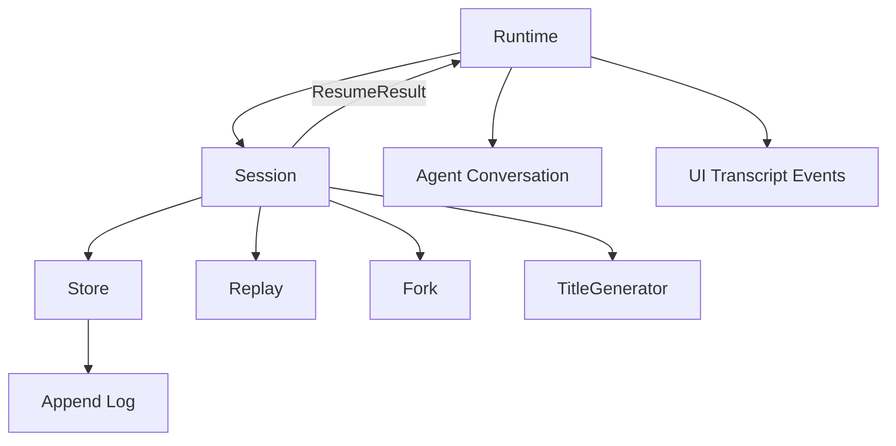

# Phase 4 - Session

## Objective

Separate session persistence, replay, fork, and title generation from runtime UI and agent mutation. Make the session log truly append-oriented and easier to diagnose.

## Current Problem

Session behavior is split across a runtime-facing session service, `SessionManager`, and `SessionStore`. The runtime-facing service currently reaches into `Agent` and `Transcript`, while storage rewrites the full conversation log for every event.

The target is a session subsystem that owns session data and returns explicit replay/fork results. Runtime and UI then decide how to apply those results.

## Files Expected To Be Touched

Primary:

- `cli/lib/src/runtime/services/session.dart`
- `cli/lib/src/session/session_manager.dart`
- `cli/lib/src/session/session_event_normalizer.dart`
- `cli/lib/src/session/title_generator.dart`
- `cli/lib/src/storage/session_store.dart`
- `cli/lib/src/storage/session_state.dart`
- `cli/lib/src/runtime/turn.dart`
- `cli/lib/src/runtime/runtime.dart`
- `cli/lib/src/runtime/transcript.dart`
- `cli/lib/src/agent/agent.dart`
- session tests under `cli/test/session/`
- runtime session tests under `cli/test/runtime/`

New or reshaped:

- `cli/lib/src/session/session.dart`
- `cli/lib/src/session/store.dart`
- `cli/lib/src/session/log.dart`
- `cli/lib/src/session/replay.dart`
- `cli/lib/src/session/fork.dart`
- `cli/lib/src/session/title.dart`
- optionally move storage session files under `session/`

## Target File Structure

```text
cli/lib/src/session/
  session.dart   # public facade for session use cases
  store.dart     # metadata and event storage
  log.dart       # append/read JSONL event log
  replay.dart    # convert stored events to conversation/runtime records
  fork.dart      # fork policy
  title.dart     # title generation orchestration
```

The old `storage/session_store.dart` can either move to `session/store.dart` or become a compatibility export during migration. The final shape should not keep session storage split across unrelated folders.

## Target Public Shape

Runtime should ask session for explicit results:

```dart
final result = await session.resume(id);
runtime.apply(result);
```

Session result:

```dart
class ResumeResult {
  const ResumeResult({
    required this.id,
    required this.events,
    required this.conversation,
    required this.diagnostics,
  });

  final String id;
  final List<SessionEvent> events;
  final Conversation conversation;
  final List<SessionDiagnostic> diagnostics;
}
```

Session should not do this:

```dart
agent.clear();
transcript.replace(...);
```

Those mutations belong in runtime or UI presentation code.

## Target Storage Behavior

Current behavior:

```text
read entire conversation file
append event in memory
write entire conversation file atomically
```

Target behavior:

```text
append one JSONL event
flush
update metadata separately
on read, tolerate malformed legacy lines and report diagnostics
```

Atomic metadata writes should remain. Event logs should be append-oriented.

## Data-Flow Rules

- `Session` owns session ids, metadata, append, resume, fork, list, and title coordination.
- `Session` returns data and diagnostics.
- `Runtime` applies resumed conversation to `Agent`.
- `UI` applies presentation events to transcript.
- `TitleGenerator` receives a conversation summary and returns a title candidate.
- Session storage should not import terminal UI classes.
- Session replay should not require a live LLM client.

## Migration Steps

1. Introduce session result types.
   - `ResumeResult`
   - `ForkResult`
   - `SessionDiagnostic`
   - conversation replay records if not already present

2. Extract replay logic.
   - Move event-to-conversation reconstruction out of `SessionManager`.
   - Add tests for malformed, legacy, and partial event logs.

3. Extract fork policy.
   - Keep current truncation behavior.
   - Make the truncation point and copied metadata explicit.

4. Change runtime-facing session methods to return results.
   - Runtime applies result to agent and transcript.
   - Keep compatibility wrappers temporarily if needed.

5. Convert event logging to append.
   - Replace full-file rewrite for conversation events.
   - Preserve atomic metadata writes.
   - Add tests for appending multiple events and replaying them.

6. Move or rename storage files.
   - Prefer `session/store.dart` and `session/log.dart`.
   - Keep old exports only briefly during migration.

7. Isolate title generation.
   - Session can request title generation.
   - Title generation should not require UI state.
   - Failures should become diagnostics or quiet no-op according to current behavior.

## End-State Architecture



## Tests

Required:

- create session
- append events
- resume session
- fork session
- list sessions
- title generation success/failure
- malformed event recovery
- metadata persistence

Add if missing:

- append log does not rewrite existing content unnecessarily
- replay returns diagnostics without throwing for recoverable records
- runtime applies resume result to agent and transcript
- session code can be tested without terminal UI classes

## Acceptance Criteria

- Runtime session code no longer directly mutates both `Agent` and `Transcript`.
- Session replay and fork logic are separately testable.
- Conversation events are appended instead of full-file rewritten.
- Session storage diagnostics are available for doctor or debug output.
- `dart analyze` passes.
- full Dart tests pass.

## Risks

- Session files are user data. Keep backward compatibility with existing session logs.
- Append behavior must handle interrupted writes gracefully.
- Title generation should not block interactive responsiveness.
