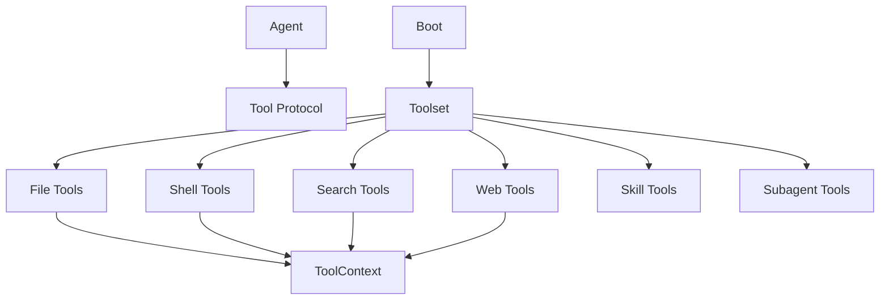

# Phase 5 - Tools

## Objective

Move from one large built-in tool module to a cohesive tool package with a stable `Tool` protocol, shared context, and focused concrete tool files.

## Current Problem

`agent/tools.dart` contains the abstract tool contract plus multiple concrete filesystem, shell, grep, edit, and list tools. The `Tool` abstraction is valid because many tools share one protocol. The weakness is that concrete tools and shared concerns are concentrated in one file and some tools directly own filesystem/process behavior.

## Files Expected To Be Touched

Primary:

- `cli/lib/src/agent/tools.dart`
- `cli/lib/src/agent/agent.dart`
- `cli/lib/src/tools/subagent_tools.dart`
- `cli/lib/src/tools/web_browser_tool.dart`
- `cli/lib/src/tools/web_fetch_tool.dart`
- `cli/lib/src/tools/web_search_tool.dart`
- `cli/lib/src/skills/skill_tool.dart`
- `cli/lib/src/shell/command_executor.dart`
- `cli/lib/src/shell/host_executor.dart`
- `cli/lib/src/shell/docker_executor.dart`
- `cli/lib/src/runtime/tool_permissions.dart`
- `cli/lib/src/runtime/permission_gate.dart`
- `cli/lib/src/boot/tools.dart`
- tool tests under `cli/test/agent/`, `cli/test/tools/`, `cli/test/web/`, `cli/test/skills/`

New or reshaped:

- `cli/lib/src/tools/tool.dart`
- `cli/lib/src/tools/context.dart`
- `cli/lib/src/tools/files.dart`
- `cli/lib/src/tools/shell.dart`
- `cli/lib/src/tools/search.dart`
- `cli/lib/src/tools/web.dart`
- `cli/lib/src/tools/skills.dart`
- `cli/lib/src/tools/subagents.dart`

## Target File Structure

Preferred:

```text
cli/lib/src/tools/
  tool.dart       # Tool, ToolCall, ToolResult, ToolError if applicable
  context.dart    # ToolContext and shared runtime inputs
  files.dart      # read/write/edit/list file tools
  shell.dart      # bash/shell execution tools
  search.dart     # grep/search local tools
  web.dart        # web fetch/search/browser tool exports or wrappers
  skills.dart     # skill activation/exposure tools
  subagents.dart  # subagent tools
```

It is fine for `files.dart` to contain related file tools together if it stays cohesive. If it grows too large, split by concept:

```text
tools/files/read.dart
tools/files/write.dart
tools/files/edit.dart
tools/files/list.dart
```

Do not split every class into its own file by default.

## Target Protocol

`Tool` remains an abstract class:

```dart
abstract class Tool {
  String get name;
  String get description;
  ToolSchema get schema;

  Future<ToolResult> call(ToolCall call, ToolContext context);
}
```

The exact method name can stay compatible with current code. The important part is that tool execution receives a context instead of pulling scattered dependencies from constructors or globals.

`ToolContext` should contain stable execution facts:

```dart
class ToolContext {
  const ToolContext({
    required this.cwd,
    required this.env,
    required this.permissions,
    required this.executor,
    required this.limits,
  });
}
```

Do not create interfaces for every field unless tests or multiple implementations require them. Concrete collaborators are fine.

## Shared Concerns To Centralize

- cwd/path normalization
- path display formatting
- max output size and truncation
- binary file detection
- permission facts
- shell timeout policy
- process result normalization
- structured error formatting

These should be shared by composition or helper functions with specific names, not by an inheritance hierarchy.

## Migration Steps

1. Move the protocol first.
   - Extract `Tool`, `ToolResult`, schemas, and call records to `tools/tool.dart`.
   - Update `Agent` to import the protocol from `tools/tool.dart`.
   - Keep concrete tools temporarily exported for compatibility.

2. Introduce `ToolContext`.
   - Add the minimal fields needed by current tools.
   - Avoid speculative fields.
   - Update tool invocation in `Agent` or runtime wiring.

3. Move local file tools.
   - Read, write, edit, list belong together initially.
   - Preserve behavior exactly.
   - Add focused tests around path and binary behavior.

4. Move shell/search tools.
   - Shell execution should use existing `CommandExecutor`.
   - Grep/search should share process handling and output limits.

5. Move web/skill/subagent tools behind the same package surface.
   - Existing web implementation can stay in `web/` if it is a web subsystem.
   - The `tools/` file should expose tool wrappers and registration.

6. Update boot wiring.
   - Tool construction moves to `boot/tools.dart`.
   - Tool registration should return a typed `Toolset`, not a raw mutable map if a `Toolset` reduces mistakes.

7. Remove `agent/tools.dart`.
   - It may temporarily export `tools/tool.dart`.
   - Final state should not keep the old file as a dumping ground.

## End-State Architecture



## Tests

Required:

- existing agent tool-call tests
- file read/write/edit/list behavior
- grep/search behavior
- shell command execution and permission behavior
- web tool registration
- skill tool registration
- subagent tool registration

Add if missing:

- `ToolContext` construction tests
- output truncation tests
- path normalization tests
- tool result structured error tests
- boot toolset registration test

## Acceptance Criteria

- `Agent` depends only on the tool protocol, not concrete built-in tools.
- Built-in concrete tools are no longer in `agent/tools.dart`.
- Shared path/process/output behavior is centralized.
- Tool construction happens in boot wiring.
- `Tool` remains the meaningful abstraction; no new single-implementation abstract classes are introduced.
- `dart analyze` passes.
- full Dart tests pass.

## Risks

- Moving tool files can cause import churn. Extract protocol first, then move concrete tools.
- Tool behavior is user-visible. Preserve exact output formatting unless a test explicitly approves a compatibility fix.
- Do not wrap every Dart IO class in an interface. Use temp dirs and concrete collaborators unless testability requires a seam.
