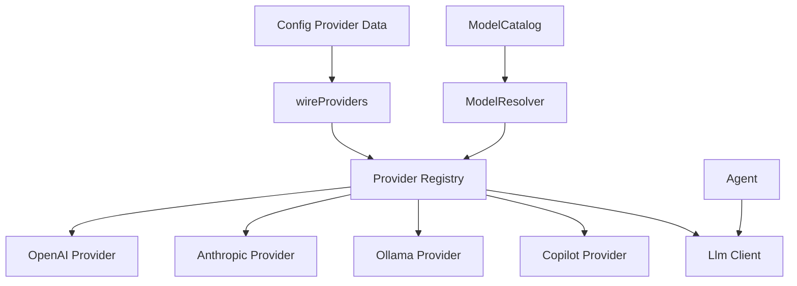

# Phase 6 - Providers

## Objective

Normalize provider/client naming and responsibilities. Remove stale adapter vocabulary unless a class is actually adapting one interface to another.

## Current Problem

Provider code currently has mixed naming around providers, adapters, factories, resolved provider state, and LLM clients. The Ollama rename shows the codebase is already moving toward provider naming, but tests and discovery need to align.

The goal is a clear model:

- `Provider` owns provider identity, auth/capability/model support, and creation of clients.
- `Client` owns the streaming API call to a specific provider.
- `Catalog` owns model metadata and resolution.
- `Config` owns provider configuration data only.

If a concrete provider is also the client and that remains simpler, that is acceptable. The important part is to choose one convention and remove old vocabulary.

## Files Expected To Be Touched

Primary:

- `cli/lib/src/providers/provider_adapter.dart`
- `cli/lib/src/providers/llm_client_factory.dart`
- `cli/lib/src/providers/openai_provider.dart`
- `cli/lib/src/providers/anthropic_provider.dart`
- `cli/lib/src/providers/ollama_provider.dart`
- `cli/lib/src/providers/copilot_provider.dart`
- `cli/lib/src/providers/resolved.dart`
- `cli/lib/src/providers/compatibility_profile.dart`
- `cli/lib/src/providers/auth_flow.dart`
- `cli/lib/src/providers/api_key_prompt_panel.dart`
- `cli/lib/src/providers/device_code_panel.dart`
- `cli/lib/src/catalog/*`
- `cli/lib/src/llm/llm.dart`
- `cli/lib/src/llm/llm_factory.dart`
- `cli/lib/src/config/*`
- provider tests under `cli/test/providers/`
- catalog/model resolver tests

New or reshaped:

- `cli/lib/src/providers/provider.dart`
- `cli/lib/src/providers/openai.dart`
- `cli/lib/src/providers/anthropic.dart`
- `cli/lib/src/providers/ollama.dart`
- `cli/lib/src/providers/copilot.dart`
- `cli/lib/src/providers/auth.dart`
- `cli/lib/src/providers/catalog.dart` only if it does not duplicate `catalog/`

## Target File Structure

```text
cli/lib/src/providers/
  provider.dart    # provider contract and provider registry records
  openai.dart
  anthropic.dart
  ollama.dart
  copilot.dart
  auth.dart
  resolved.dart
  compat.dart

cli/lib/src/llm/
  llm.dart         # Llm/Client streaming protocol
  chunks.dart      # if useful
  schema.dart      # tool schema/message mapper if useful
```

Keep `catalog/` as the home for model catalog parsing, display, refresh, and resolver behavior unless phase work proves it belongs under providers.

## Target Responsibility Split

Provider:

```dart
abstract class Provider {
  String get name;
  Future<ProviderStatus> status();
  Future<Llm> client(ModelRef model);
}
```

This abstraction is meaningful because there are multiple providers. If the current `ProviderAdapter` already expresses this, rename it and tighten responsibilities rather than adding another layer.

Client:

```dart
abstract class Llm {
  Stream<LlmChunk> stream(List<Message> messages, LlmOptions options);
}
```

Factory:

- Keep a factory only if it coordinates multiple provider implementations.
- Prefer top-level boot functions if the factory has one caller and no independent behavior.

## Naming Decisions

Preferred:

- `Provider`
- `OpenAI`
- `Anthropic`
- `Ollama`
- `Copilot`
- `Llm`
- `ModelCatalog`
- `ModelResolver`
- `ResolvedModel`

Avoid:

- `ProviderAdapter`, unless adapting an external provider object to the internal `Provider` contract.
- `LlmClientFactory`, if it is only used by boot wiring.
- `OllamaAdapter` and `OllamaClient` if the provider is now the client.

## Migration Steps

1. Finish stale Ollama cleanup.
   - Ensure tests use provider naming.
   - Remove old adapter file references.

2. Rename the provider contract.
   - `ProviderAdapter` becomes `Provider` if it is the core contract.
   - Keep a temporary export only if needed for incremental migration.

3. Decide provider/client shape.
   - Option A: provider creates separate client.
   - Option B: provider implements LLM streaming directly.
   - Pick one convention and apply it to all providers.
   - Do not keep both patterns unless one provider has a concrete reason.

4. Move factory behavior into boot if appropriate.
   - If `LlmClientFactory` only wires concrete providers, move it to `boot/providers.dart`.
   - If it contains reusable resolution behavior, rename it to the thing it does, such as `ProviderRegistry`.

5. Rename provider files.
   - `openai_provider.dart` -> `openai.dart`
   - `anthropic_provider.dart` -> `anthropic.dart`
   - `ollama_provider.dart` -> `ollama.dart`
   - `copilot_provider.dart` -> `copilot.dart`

6. Keep auth UI at the edge.
   - Prompt panels belong in UI/provider auth boundary code.
   - Provider core should not directly render terminal UI.

7. Update config and catalog integration.
   - `Config` stores provider settings.
   - Catalog resolves model refs.
   - Boot constructs providers.

## End-State Architecture



## Tests

Required:

- provider resolution tests
- model ref parsing tests
- auth flow tests
- provider status/capability tests
- streaming client tests with fake HTTP
- catalog integration tests

Add if missing:

- test that old adapter names are absent from public imports
- test provider registry selects the expected provider for a resolved model
- test boot provider wiring with fake config

## Acceptance Criteria

- Provider naming is consistent.
- No stale Ollama adapter test/file reference remains.
- `ProviderAdapter` is deleted or renamed to `Provider`.
- Factories with only one caller are moved into boot wiring or renamed to a concrete responsibility.
- Provider core is separate from terminal prompt rendering where practical.
- `dart analyze` passes.
- full Dart tests pass.

## Risks

- Provider auth and UI are naturally close because credentials may require prompts. Keep the interaction explicit rather than hiding UI dependencies inside providers.
- Renaming provider files creates broad import churn. Do mechanical renames separately from responsibility changes.
- Do not over-split clients if each provider's current implementation is simple and well-tested.
