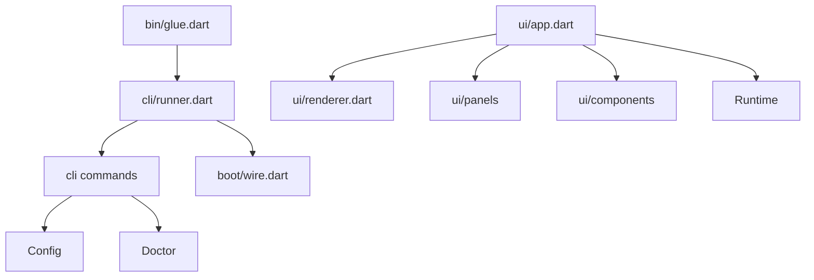

# Phase 7 - UI And CLI Decomposition

## Objective

Split large UI and CLI files by responsibility, remove remaining `part` files, and leave the app shell small enough that new UI or command behavior does not require editing a god module.

## Current Problem

Several files are large because they accumulated adjacent behavior:

- `bin/glue.dart` mixes executable entrypoint, command runner, config commands, doctor command, completion install/uninstall, and shell-specific file writes.
- `app.dart` owns broad terminal app lifecycle and has historically been a common place to add behavior.
- `app/controllers.dart` is a `part` file, which hides dependencies and makes ownership less explicit.
- `ui/components/panel.dart` is large and contains multiple component concepts.

This phase is intentionally late because moving UI and CLI files is high-churn but lower architectural risk once config, wiring, runtime, session, tools, and providers are cleaner.

## Files Expected To Be Touched

Primary:

- `cli/bin/glue.dart`
- `cli/lib/src/app.dart`
- `cli/lib/src/app/controllers.dart`
- `cli/lib/src/app/paint.dart`
- `cli/lib/src/runtime/controllers/*.dart`
- `cli/lib/src/runtime/commands/*.dart`
- `cli/lib/src/ui/components/panel.dart`
- `cli/lib/src/ui/components/box.dart`
- `cli/lib/src/ui/components/dock.dart`
- `cli/lib/src/ui/components/modal.dart`
- `cli/lib/src/ui/components/overlays.dart`
- `cli/lib/src/ui/components/tables.dart`
- `cli/lib/src/ui/services/*.dart`
- CLI command tests
- UI rendering tests
- app startup tests

New or reshaped:

- `cli/lib/src/cli/runner.dart`
- `cli/lib/src/cli/config.dart`
- `cli/lib/src/cli/doctor.dart`
- `cli/lib/src/cli/completion.dart`
- `cli/lib/src/ui/app.dart`
- `cli/lib/src/ui/panels/*.dart`
- `cli/lib/src/ui/components/panel/*.dart` if needed

## Target CLI Structure

```text
cli/bin/
  glue.dart          # tiny executable wrapper

cli/lib/src/cli/
  runner.dart        # Glue command runner
  config.dart        # config command
  doctor.dart        # doctor command
  completion.dart    # completion command and shell installers
```

`bin/glue.dart` target shape:

```dart
Future<void> main(List<String> args) async {
  final exitCode = await runGlue(args, Environment.host());
  exit(exitCode);
}
```

Top-level exception handling may stay in `bin/glue.dart` if it is only about process exit behavior. Command implementations should move out.

## Target UI Structure

```text
cli/lib/src/ui/
  app.dart
  renderer.dart
  transcript.dart

  terminal/
    terminal.dart
    layout.dart
    screen.dart

  panels/
    panel.dart
    select.dart
    model.dart
    provider.dart
    skills.dart
    session.dart

  components/
    box.dart
    dock.dart
    modal.dart
    overlays.dart
    tables.dart
    theme.dart
```

If `panel.dart` remains cohesive after smaller extractions, it can keep multiple related classes. The goal is not one class per file. The goal is that a developer looking for provider panel behavior, model panel behavior, or generic panel layout can find it quickly.

## No `part` Files

Target:

```dart
import 'controllers/chat_controller.dart';
import 'controllers/model_controller.dart';
```

Avoid:

```dart
part 'controllers.dart';
```

Normal imports make dependencies visible, tooling simpler, and test boundaries clearer.

## Migration Steps

1. Split CLI commands.
   - Move config command code to `cli/config.dart`.
   - Move doctor command code to `cli/doctor.dart`.
   - Move completion install/uninstall code to `cli/completion.dart`.
   - Keep `bin/glue.dart` as a wrapper.

2. Convert `app/controllers.dart` away from `part`.
   - Move private controller aggregation into an imported class if still needed.
   - Make controller dependencies explicit in constructors.
   - Avoid controllers reaching into a large `App` object.

3. Reduce `App`.
   - After phase 3, `App` should already be a UI shell.
   - Move any remaining workflow code to `Runtime`.
   - Keep terminal lifecycle, event subscription, and rendering in UI app.

4. Split large panel code by concept.
   - Extract generic panel layout from specific panel content.
   - Keep shared drawing helpers in specific files, not a generic utils file.
   - Preserve rendering output with snapshot tests where available.

5. Update imports and tests.
   - Prefer package-relative imports consistent with existing Dart style.
   - Remove compatibility exports after tests are updated.

6. Add architecture checks if useful.
   - Search for `part `.
   - Search for `ServiceLocator`.
   - Search for `GlueConfig`.
   - Search for stale `Adapter` names.

## End-State Architecture



## Tests

Required:

- CLI argument parsing
- config command behavior
- doctor command behavior
- completion install/uninstall behavior with fake home/config paths
- app startup and teardown
- renderer/panel snapshots or focused layout tests
- no `part` files check

Add if missing:

- test that `bin/glue.dart` delegates without constructing runtime details
- panel rendering tests for narrow terminal widths
- completion command tests per shell

## Acceptance Criteria

- `bin/glue.dart` is a small process entrypoint.
- CLI subcommands live under `lib/src/cli/`.
- No `part` files remain.
- `App` is a UI shell, not the workflow owner.
- Large panel code is split by responsibility where it materially improves navigation.
- No generic `utils` dumping ground is introduced.
- `dart analyze` passes.
- full Dart tests pass.

## Risks

- UI rendering can regress through tiny formatting changes. Use existing snapshots or add focused renderer tests before moving rendering code.
- Completion installation has shell-specific edge cases. Move code mechanically first, then simplify.
- Do not split UI files so aggressively that related rendering rules become harder to follow.
